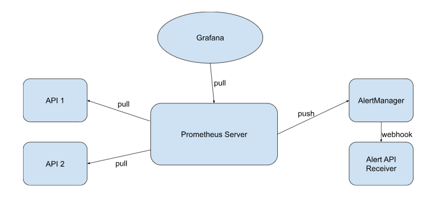

**Architecture**

The APIs (API 1/2) expose metrics through the /metrics endpoint. Prometheus retrieves all metrics, processes the information, and stores it in its storage. Prometheus has several rules to monitor API states. For instance, it raises an alert when the API returns any 5xx status code. When Prometheus triggers an alert, it sends a request to AlertManager, which processes this data based on its severity and sends a webhook request to the Alert API Receiver. This API merely logs the alert, but it can be substituted with another receiver such as Telegram, Slack, or another communication platform to notify all relevant parties about the alert. Grafana get all metrics from prometheus to represent these metric in graphs.

